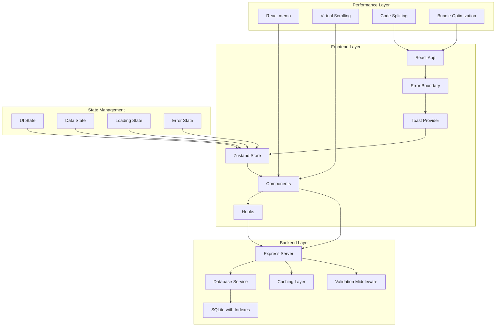

# BOQ Builder Critical Improvements - Design Document

## Overview

This design document outlines the technical architecture and implementation approach for critical improvements to the BOQ Builder application. The design focuses on creating a more robust, performant, and maintainable application through modern React patterns, centralized state management, comprehensive error handling, and optimized database operations.

The improvements will be implemented in phases, starting with foundational stability and performance enhancements, followed by user experience improvements and advanced features. The design emphasizes backward compatibility while modernizing the codebase.

## Architecture

### High-Level Architecture Changes



### State Management Architecture

The application will transition from multiple `useState` hooks to a centralized Zustand store with the following structure:

```typescript
interface AppState {
  ui: {
    modals: Record<string, boolean>
    panels: { showItemDB: boolean; showSummary: boolean }
    loading: Record<string, boolean>
  }
  data: {
    boqItems: BOQItem[]
    masterDatabase: Item[]
    categories: string[]
    currentProject: Project | null
    filters: SearchFilters
  }
  errors: Record<string, string | null>
  actions: {
    // UI actions
    toggleModal: (modal: string) => void
    setLoading: (key: string, value: boolean) => void
    
    // Data actions
    addBOQItem: (item: Item, quantity: number) => void
    updateBOQItem: (id: string, updates: Partial<BOQItem>) => void
    removeBOQItem: (id: string) => void
    
    // Filter actions
    setSearchTerm: (term: string) => void
    setCategory: (category: string) => void
  }
}
```

## Components and Interfaces

### Error Handling System

#### ErrorBoundary Component
```typescript
interface ErrorBoundaryProps {
  children: React.ReactNode
  fallback?: React.ComponentType<ErrorFallbackProps>
  onError?: (error: Error, errorInfo: ErrorInfo) => void
}

interface ErrorFallbackProps {
  error: Error
  resetError: () => void
  hasError: boolean
}
```

**Key Features:**
- Catches JavaScript errors in component tree
- Displays user-friendly error messages
- Provides retry mechanisms
- Logs errors for debugging in development
- Preserves user data when possible

#### Toast Notification System
```typescript
interface ToastOptions {
  type: 'success' | 'error' | 'info' | 'warning'
  duration?: number
  position?: 'top-right' | 'top-left' | 'bottom-right' | 'bottom-left'
  dismissible?: boolean
}

interface ToastAPI {
  success: (message: string, options?: ToastOptions) => void
  error: (message: string, options?: ToastOptions) => void
  info: (message: string, options?: ToastOptions) => void
  promise: <T>(promise: Promise<T>, messages: PromiseMessages) => Promise<T>
}
```

### Performance Optimization Components

#### VirtualizedList Component
```typescript
interface VirtualizedListProps<T> {
  items: T[]
  itemHeight: number
  containerHeight: number
  renderItem: (item: T, index: number) => React.ReactNode
  overscan?: number
  onScroll?: (scrollTop: number) => void
}
```

**Implementation Details:**
- Uses `react-window` for efficient rendering of large lists
- Only renders visible items plus overscan buffer
- Supports dynamic item heights for complex layouts
- Maintains scroll position during data updates

#### MemoizedComponents
```typescript
// Memoized table row component
const BOQTableRow = React.memo<BOQTableRowProps>(({ 
  item, 
  onUpdateQuantity, 
  onRemoveItem 
}) => {
  // Component implementation
}, (prevProps, nextProps) => {
  // Custom comparison function for optimization
  return prevProps.item.id === nextProps.item.id &&
         prevProps.item.quantity === nextProps.item.quantity &&
         prevProps.item.unitPrice === nextProps.item.unitPrice
})
```

### Database Optimization Layer

#### Enhanced Database Service
```typescript
interface DatabaseService {
  // Core CRUD operations
  getItems(options: QueryOptions): Promise<PaginatedResult<Item>>
  addItem(item: CreateItemRequest): Promise<Item>
  updateItem(id: string, updates: UpdateItemRequest): Promise<Item>
  deleteItem(id: string): Promise<void>
  
  // Optimized queries
  searchItems(query: SearchQuery): Promise<Item[]>
  getItemsByCategory(category: string): Promise<Item[]>
  getBOQWithDependencies(projectId: string): Promise<BOQItem[]>
  
  // Caching operations
  clearCache(pattern?: string): void
  getCacheStats(): CacheStats
}

interface QueryOptions {
  page?: number
  limit?: number
  search?: string
  category?: string
  sortBy?: string
  sortOrder?: 'asc' | 'desc'
}
```

**Optimization Features:**
- Database indexes on frequently queried columns
- Query result caching with TTL
- Prepared statements for better performance
- Connection pooling for concurrent requests
- Pagination for large result sets

### Form Validation System

#### Validation Schema Definition
```typescript
interface ValidationSchema<T> {
  [K in keyof T]?: ValidationRule<T[K]>[]
}

interface ValidationRule<T> {
  validate: (value: T) => boolean | string
  message?: string
  when?: (formData: any) => boolean
}

interface ValidationResult {
  isValid: boolean
  errors: Record<string, string>
  warnings?: Record<string, string>
}
```

#### Form Hook Implementation
```typescript
interface UseValidatedFormOptions<T> {
  schema: ValidationSchema<T>
  defaultValues?: Partial<T>
  mode?: 'onChange' | 'onBlur' | 'onSubmit'
  revalidateMode?: 'onChange' | 'onBlur'
}

interface UseValidatedFormReturn<T> {
  values: T
  errors: Record<keyof T, string>
  isValid: boolean
  isSubmitting: boolean
  setValue: (field: keyof T, value: any) => void
  setError: (field: keyof T, message: string) => void
  handleSubmit: (onSubmit: (data: T) => Promise<void>) => Promise<void>
  reset: (values?: Partial<T>) => void
}
```

### Search and Filtering System

#### Advanced Search Hook
```typescript
interface SearchFilters {
  search: string
  category: string
  priceRange: [number, number]
  manufacturer: string
  inStock?: boolean
  tags: string[]
}

interface SearchOptions {
  debounceMs: number
  minSearchLength: number
  searchFields: string[]
  caseSensitive: boolean
}

interface UseAdvancedSearchReturn<T> {
  filteredItems: T[]
  filters: SearchFilters
  setFilters: (filters: Partial<SearchFilters>) => void
  clearFilters: () => void
  isSearching: boolean
  resultCount: number
  searchStats: SearchStats
}
```

**Search Features:**
- Real-time search with debouncing
- Multi-field text search with highlighting
- Range filters for numeric values
- Tag-based filtering
- Search result ranking and relevance scoring
- Search history and suggestions

### Bulk Operations System

#### Multi-Select Hook
```typescript
interface UseMultiSelectOptions {
  selectMode: 'checkbox' | 'row' | 'both'
  maxSelections?: number
  onSelectionChange?: (selectedIds: string[]) => void
}

interface UseMultiSelectReturn {
  selectedItems: Set<string>
  isSelected: (id: string) => boolean
  toggleItem: (id: string) => void
  selectAll: () => void
  clearSelection: () => void
  selectRange: (startId: string, endId: string) => void
  selectedCount: number
  hasSelection: boolean
}
```

#### Bulk Operations Component
```typescript
interface BulkOperationsProps {
  selectedItems: string[]
  availableOperations: BulkOperation[]
  onOperation: (operation: string, items: string[]) => Promise<void>
  maxBatchSize?: number
}

interface BulkOperation {
  id: string
  label: string
  icon: React.ComponentType
  color: string
  requiresConfirmation: boolean
  batchSize?: number
}
```

## Data Models

### Enhanced Item Model
```typescript
interface Item {
  id: string
  name: string
  category: string
  manufacturer?: string
  partNumber?: string
  unit: string
  unitPrice: number
  unitNetPrice?: number
  serviceDuration?: number
  estimatedLeadTime?: number
  pricingTerm: string
  discount?: number
  description?: string
  tags: string[]
  dependencies: ItemDependency[]
  metadata: ItemMetadata
  createdAt: Date
  updatedAt: Date
}

interface ItemDependency {
  itemId: string
  quantity: number
  isOptional: boolean
  description?: string
}

interface ItemMetadata {
  isActive: boolean
  stockLevel?: number
  lastPriceUpdate?: Date
  supplierInfo?: SupplierInfo
}
```

### Project and BOQ Models
```typescript
interface Project {
  id: string
  name: string
  description?: string
  status: 'draft' | 'active' | 'completed' | 'archived'
  metadata: ProjectMetadata
  settings: ProjectSettings
  createdAt: Date
  updatedAt: Date
}

interface ProjectMetadata {
  client?: string
  location?: string
  estimatedValue?: number
  deadline?: Date
  tags: string[]
}

interface BOQItem extends Item {
  quantity: number
  isDependency: boolean
  requiredBy?: string
  customPrice?: number
  notes?: string
  lineTotal: number
}
```

## Error Handling

### Error Classification System
```typescript
enum ErrorType {
  VALIDATION = 'validation',
  NETWORK = 'network',
  DATABASE = 'database',
  PERMISSION = 'permission',
  BUSINESS_LOGIC = 'business_logic',
  UNKNOWN = 'unknown'
}

interface AppError {
  type: ErrorType
  code: string
  message: string
  details?: any
  timestamp: Date
  userId?: string
  context?: Record<string, any>
}
```

### Error Recovery Strategies
```typescript
interface ErrorRecoveryStrategy {
  canRecover: (error: AppError) => boolean
  recover: (error: AppError) => Promise<boolean>
  fallback?: () => void
}

const errorRecoveryStrategies: Record<ErrorType, ErrorRecoveryStrategy> = {
  [ErrorType.NETWORK]: {
    canRecover: (error) => error.code === 'TIMEOUT' || error.code === 'CONNECTION_LOST',
    recover: async (error) => {
      // Retry with exponential backoff
      return retryWithBackoff(() => originalRequest(), 3)
    },
    fallback: () => showOfflineMode()
  },
  // ... other strategies
}
```

### Global Error Handler
```typescript
interface ErrorHandler {
  handleError: (error: AppError) => void
  reportError: (error: AppError) => Promise<void>
  shouldShowToUser: (error: AppError) => boolean
  getRecoveryOptions: (error: AppError) => RecoveryOption[]
}
```

## Testing Strategy

### Unit Testing Approach
```typescript
// Example test structure for components
describe('BOQTable', () => {
  describe('rendering', () => {
    it('should render empty state when no items provided', () => {
      render(<BOQTable items={[]} />)
      expect(screen.getByText('No items in BOQ')).toBeInTheDocument()
    })
    
    it('should render items with correct calculations', () => {
      const mockItems = createMockBOQItems()
      render(<BOQTable items={mockItems} />)
      
      mockItems.forEach(item => {
        expect(screen.getByText(item.name)).toBeInTheDocument()
        expect(screen.getByText(`$${item.lineTotal}`)).toBeInTheDocument()
      })
    })
  })
  
  describe('interactions', () => {
    it('should call onUpdateQuantity when quantity is changed', async () => {
      const onUpdateQuantity = jest.fn()
      const mockItems = createMockBOQItems()
      
      render(<BOQTable items={mockItems} onUpdateQuantity={onUpdateQuantity} />)
      
      const quantityInput = screen.getByDisplayValue('1')
      await user.type(quantityInput, '{selectall}5')
      
      expect(onUpdateQuantity).toHaveBeenCalledWith(mockItems[0].id, 5)
    })
  })
})
```

### Integration Testing Strategy
```typescript
// Example integration test for store operations
describe('BOQ Store Integration', () => {
  it('should add item with dependencies correctly', async () => {
    const store = createTestStore()
    const mockItem = createMockItemWithDependencies()
    
    store.getState().actions.addBOQItem(mockItem, 2)
    
    const state = store.getState()
    expect(state.data.boqItems).toHaveLength(3) // Main item + 2 dependencies
    expect(state.data.boqItems[0].quantity).toBe(2)
    expect(state.data.boqItems[1].isDependency).toBe(true)
  })
})
```

### Performance Testing
```typescript
// Performance benchmarks
const performanceTests = {
  'Large item list rendering': {
    setup: () => createMockItems(10000),
    test: (items) => render(<VirtualizedItemList items={items} />),
    threshold: 100 // ms
  },
  
  'Search with large dataset': {
    setup: () => createMockItems(50000),
    test: (items) => searchItems(items, 'camera'),
    threshold: 50 // ms
  },
  
  'BOQ calculation with many items': {
    setup: () => createMockBOQItems(1000),
    test: (items) => calculateBOQTotal(items),
    threshold: 10 // ms
  }
}
```

## Implementation Phases

### Phase 1: Foundation (Week 1)
- Error boundary implementation
- Toast notification system
- Basic loading states
- Database index optimization
- Core validation utilities

### Phase 2: State Management (Week 2)
- Zustand store setup
- Component refactoring to use store
- State persistence
- Performance optimizations (React.memo)

### Phase 3: User Experience (Week 3)
- Advanced search and filtering
- Bulk operations
- Enhanced export capabilities
- Form validation integration

### Phase 4: Advanced Features (Week 4)
- Virtual scrolling implementation
- Code splitting and lazy loading
- Advanced project management
- Comprehensive testing

### Phase 5: Polish and Optimization (Week 5)
- Performance monitoring
- Bundle optimization
- Accessibility improvements
- Documentation and deployment

## Security Considerations

### Input Sanitization
```typescript
interface SanitizationRules {
  allowedTags: string[]
  allowedAttributes: Record<string, string[]>
  maxLength: number
  stripScripts: boolean
}

const sanitizeInput = (input: string, rules: SanitizationRules): string => {
  // Implementation for HTML sanitization
  // XSS prevention
  // SQL injection prevention
}
```

### API Security
- Rate limiting on all endpoints
- Input validation middleware
- CSRF protection for state-changing operations
- Secure headers (helmet.js)
- Request size limits

### Data Protection
- Sensitive data encryption at rest
- Secure session management
- Audit logging for data changes
- Backup encryption and validation

This design provides a comprehensive foundation for implementing the critical improvements while maintaining code quality, performance, and security standards.